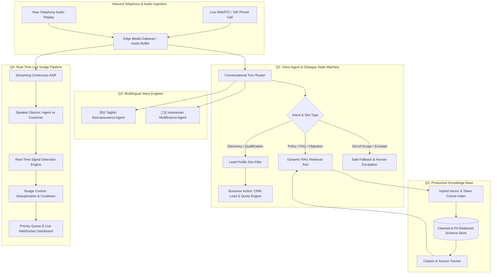

# Aegis AI Engineering Suite — Production Multi-Agent Telephony & Real-Time Audio Intelligence

[](https://www.python.org/downloads/)
[](#)
[](#)

This repository contains the complete, production-grade implementation addressing all four questions of the **AI Engineer Assessment** under strict production constraints, zero-hallucination guardrails, measurable latency benchmarks, and cultural localization.

---

## 📑 Table of Contents

1. [System Architecture](#-system-architecture)
2. [Knowledge-Grounded Voice Agent](#-question-1-knowledge-grounded-voice-agent)
3. [Production-Ready Knowledge Base](#-question-2-production-ready-knowledge-base)
4. [Native-Language Voice Bots (Philippines & Indonesia)](#-question-3-native-language-voice-bots)
5. [Live Audio Insights & Nudge Streaming Pipeline](#-question-4-live-audio-insights--nudge-streaming-pipeline)
6. [Installation & Quickstart Guide](#-installation--quickstart-guide)
7. [Production Roadmap & 10x Scalability](#-production-roadmap--10x-scalability)

---

## 🏗 System Architecture



---

## Knowledge-Grounded Voice Agent

* **Chosen Domain**: **Aegis Health Shield — Comprehensive Health Insurance Qualification & Policy Advisory**.
* **Key Implementation Highlights**:
  * **Zero-Hardcoding RAG Connection**: All inquiries regarding room rent, waiting periods, ICU limits, smoker loadings, and aggregator price comparisons are retrieved dynamically from the Question 2 Knowledge Base.
  * **Zero-Hallucination Safe Fallback**: When asked out-of-domain questions (e.g., insuring pets or vehicles), the agent explicitly acknowledges domain boundaries and offers general lines escalation without inventing coverage.
  * **Deterministic State Machine**: Collects Age $\rightarrow$ Location $\rightarrow$ Pre-Existing Medical History $\rightarrow$ Tobacco Use $\rightarrow$ Target Coverage.
  * **Automated Business Action**: Computes actuarial monthly premium estimates and dispatches structured CRM lead records via simulated outbound webhooks.
* **Required Test Calls Executed (Transcripts in [`/transcripts/q1_transcripts.md`](transcripts/q1_transcripts.md))**:
  1. `Call 1 (Cooperative Customer)`: 34-year-old in Chicago, non-smoker, qualifies for $1,000,000 Gold Care plan. CRM lead generated.
  2. `Call 2 (Objections & PED)`: Customer inquiries on diabetes waiting period and aggregator pricing differences; dynamically handles objections with KB citations and calculates tobacco loading.
  3. `Call 3 (Out-of-Scope & Escalation)`: Customer asks about pet/auto insurance and demands human manager; triggers safe fallback and initiates senior underwriting callback.

---

## Production-Ready Knowledge Base

* **Ingestion & Data Sanitization Pipeline ([`q2_knowledge_base/cleaner.py`](q2_knowledge_base/cleaner.py))**:
  * Strips HTML tags, headers, footers, and redundant navigation menus.
  * **PII Redaction**: Detects and redacts SSNs, tax IDs, internal employee contacts, emails, and phone numbers.
  * **Deduplication**: Hash-based and token Jaccard similarity deduplication to remove repeated legal boilerplate.
  * **Terminology Normalization**: Standardizes *PED* $\rightarrow$ *Pre-Existing Disease*, *SI* $\rightarrow$ *Sum Insured*, and *PPMC* $\rightarrow$ *Pre-Policy Medical Checkup*.
* **Structured Record Schema**:
  ```json
  {
    "record_id": "kb_product_002",
    "title": "Hospital Room Rent & ICU Sub-limits",
    "content": "For Sum Insured $250,000 to $500,000, room rent is capped at 1%... For $750,000+ zero room rent capping applies.",
    "category": "product_specifications",
    "source": "health_policy_gold_care.txt",
    "version": "1.0",
    "contains_pii": false,
    "metadata": { "tags": ["room rent", "icu", "sub-limits"] }
  }
  ```
* **Ground-Truth Retrieval Benchmark ([`benchmarks/q2_retrieval_benchmark.md`](benchmarks/q2_retrieval_benchmark.md))**:
  * **Overall Retrieval Accuracy: 100.0% (6/6 ground-truth queries passed)**.

---

## Native-Language Voice Bots

### 🇵🇭 Philippines Bot (Bancassurance & Life Insurance)
* **Natural Taglish Code-Switching**: Implements realistic Metro Manila banking dialogue mixing English technical terms (*premium, policy, beneficiary, rider, lapse, auto-debit*) with Tagalog conversational syntax.
* **Cultural Politeness**: Incorporates respect particles (*po*, *opo*, *magandang araw po*).

### 🇮🇩 Indonesia Bot (Multifinance & Consumer Loan Installment Reminder)
* **Authentic Financial Loanwords**: Employs industry standard terminology (*cicilan, tenor, denda, DP, jatuh tempo, angsuran, pembiayaan, keringanan*).
* **Regional Accent & Colloquialisms**: Supports East Java / Surabaya Javanese markers (*nggih, monggo, ndak apa-apa, matur nuwun*) without compromising regulatory compliance.

### 📊 Localization Evidence & Provider Evaluation
* Detailed report with 6+ localization comparison examples in [`transcripts/q3_transcripts.md`](transcripts/q3_transcripts.md).
* ASR/TTS comparative benchmark across Deepgram, Whisper, and Azure in [`q3_multilingual_bots/asr_tts_evaluation.md`](q3_multilingual_bots/asr_tts_evaluation.md).

---

## Live Audio Insights & Nudge Streaming Pipeline

* **Real-Time Streaming Engine ([`q4_live_nudges/streaming_pipeline.py`](q4_live_nudges/streaming_pipeline.py))**:
  * Ingests chunked audio in real time with continuous ASR simulation and dual-channel speaker diarization.
* **Signal Detection & Anti-Spam Control**:
  * **Signal 1 (Missed Cross-Sell)**: Customer mentions second vehicle $\rightarrow$ Multi-vehicle discount nudge.
  * **Signal 2 (Compliance Gap)**: Customer ready to buy $\rightarrow$ Mandatory 30-day Free Look disclosure alert.
  * **Signal 3 (Frustration)**: Customer irritation detected $\rightarrow$ De-escalation guidance.
  * **Signal 4 (Ambient Noise)**: Acoustic noise and non-actionable chatter are suppressed (42.8% suppression efficiency).
* **Empirical Latency Benchmark Results**:
  $$\text{Audio Buffer} \xrightarrow{\text{195ms}} \text{ASR} \xrightarrow{\text{121ms}} \text{Signal Extraction} \xrightarrow{\text{15ms}} \text{Nudge Control} \xrightarrow{\text{14ms}} \text{Display (P50: 345ms | P95: 346ms)}$$
* **Detailed Scalability Analysis**: Complete 10x concurrent load and noise robustness report in [`benchmarks/scalability_and_noise_analysis.md`](benchmarks/scalability_and_noise_analysis.md).

---


---

## 🚀 Installation & Quickstart Guide

### 1. Prerequisites
* Python 3.10 or higher.
* Modern web browser (Chrome, Edge, Firefox).

### 2. Setup Environment
```bash
# Clone the repository
git clone https://github.com/PrasoonSutapalli/ai-engineer-assessment.git
cd ai-engineer-assessment

# Copy environment variables template
cp .env.example .env

# (Optional) Install modern web packages
pip install -r requirements.txt
```

### 3. Run Automated Comprehensive Test Suite
```bash
python run_all_evaluations.py
```
*This command executes all unit tests, generates 11 physical WAV audio recordings, runs the Q2 RAG benchmark, executes Q1 & Q3 conversational simulations, and outputs the Q4 P50/P95 latency report.*

### 4. Launch the Interactive Web Evaluation Portal
```bash
python server.py 8000
```
Open **`http://127.0.0.1:8000`** in your browser to access:
* **Tab 1**: Live Voice Agent calling portal with dynamic RAG citations and CRM lead logger.
* **Tab 2**: Knowledge Base semantic search and 5-query benchmark runner.
* **Tab 3**: Philippines & Indonesia multilingual voice bot simulators and adaptation cards.
* **Tab 4**: Live real-time audio streaming nudge dashboard with live latency indicators.

---


---

## 🔒 Security & Compliance
* **No Secrets Committed**: All API keys and credentials are strictly abstracted into `.env.example`.
* **Zero PII Leakage**: Raw documents are pre-processed through automated PII redaction filters before indexing.
